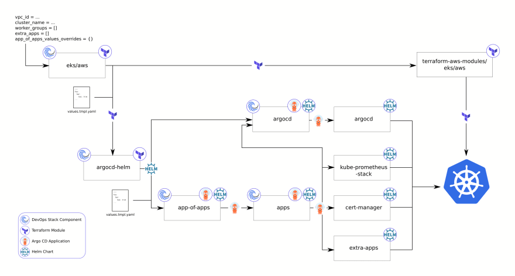

# Josh's `Homelab`

**Hey, there!**

**I’m Josh, and I’m passionate about creating educational tech content for IT Pros and Homelab nerds.**

This Repository **Homelab** contains all my homelab documentation files. Here you'll find notes, setups, and configurations for infrastructure, applications, networking, and more.

> :warning: Be aware, products can change over time. I do my best to keep up with the latest changes and releases, but please understand that this won’t always be the case.

I created them as free resources to be used in your specific use cases. If you're searching for detailed, in-depth tutorials on some tools or technologies, check out my [YouTube Channel](https://www.youtube.com/@JoshGeissler).

## Table of Contents
1. [Overview](#overview)
2. [Prerequisites](#prerequisites)
3. [Usage](#usage)
4. [Infrastructure Diagram](#infrastructure-diagram)
5. [Terraform Variable Configuration](#terraform-variable-configuration)
6. [Terraform Outputs](#terraform-outputs)
7. [Terraform Modules](#terraform-modules)
8. [Configuration](#configuration)
9. [Managing ArgoCD Applications](#managing-argocd-applications)
10. [Cleanup](#cleanup)
11. [License](#license)

---

## Overview
This project provides a Terraform script for deploying an EKS cluster on AWS as a Platform as a Service (PaaS). It includes modules for VPC, EKS, and Kubernetes addons, and it's designed to be easily configurable and extensible.

---

## Prerequisites
Before you begin, make sure you have the following:
- AWS CLI: Installed and configured with the necessary permissions.
- Terraform: Version 0.12 or higher installed.
- AWS Account: Required for deploying resources. Make sure you have access keys.
- ACM Certificate: A valid ACM certificate for your domain is required for secure communication.

---

## Usage
Follow these steps to deploy your EKS cluster:
1. **Clone this repository**: Clone the repository to your local machine.
2. **Navigate**: Go to the directory containing `main.tf`.
3. **Initialize Terraform**: Run `terraform init` to initialize your Terraform workspace.
4. **Plan Deployment**: Run `terraform plan` to see the execution plan.
5. **Apply Deployment**: Run `terraform apply` to apply the plan and create resources.
6. **Review**: Check the AWS console to review the created resources.

---

## Argo App of Apps Diagram

---

## Terraform Variable Configuration
Variables allow you to customize the deployment. You can set these in `terraform.tfvars` or as environment variables.

| Variable                | Description                    | Default  |
| ----------------------- | ------------------------------ | -------- |
| `aws_region`            | AWS region where resources will be deployed. | `us-east-1` |
| `acm_certificate_arn`   | The ARN of the ACM certificate for securing the cluster. | `""`     |
| `eks_cluster_domain_name`| The domain name that will be associated with the EKS cluster. | `""`     |

---

## Terraform Outputs
These are the outputs you will get after a successful deployment.

| Output         | Description       |
| -------------- | ----------------- |
| `cluster_name` | The name of the deployed EKS cluster.  |
| `argo_password`| The password for accessing ArgoCD.    |

---

## Terraform Modules

### VPC Module
- **Purpose**: Creates a Virtual Private Cloud (VPC) in AWS.
- **Components**: Includes subnets, NAT gateways, and route tables.

### EKS Module (`module "eks"`)
- **Purpose**: Sets up an Elastic Kubernetes Service (EKS) cluster.
- **Components**: Includes node groups and security groups.

### EKS Blueprints Kubernetes Addons Module (`module "eks_blueprints_kubernetes_addons"`)
- **Purpose**: Deploys additional Kubernetes services via Helm.
- **Components**: Includes extensions like Prometheus for monitoring and ArgoCD for continuous deployment.

---

## Configuration
You can customize the deployment by modifying settings in `variables.tf`.

---

## Managing ArgoCD Applications
ArgoCD is used for deploying applications on the EKS cluster.

### App of Apps Pattern
- **What it is**: A pattern that allows you to manage multiple Kubernetes applications as a single entity.
- **How to Use**: Modify the `argocd_applications` block in `eks_blueprints_kubernetes_addons`.

### Deploying Applications to Specific Domains
- **What it is**: A feature that allows you to specify the domain where an application will be deployed.
- **How to Use**: Annotations in the Helm chart values can be used for this. Refer to the VaultWarden example for more details.

---

## Cleanup
To remove all the resources created by this script, run `terraform destroy`.

---

## License
This script is distributed under the MIT License. See `LICENSE.md` for more details.
